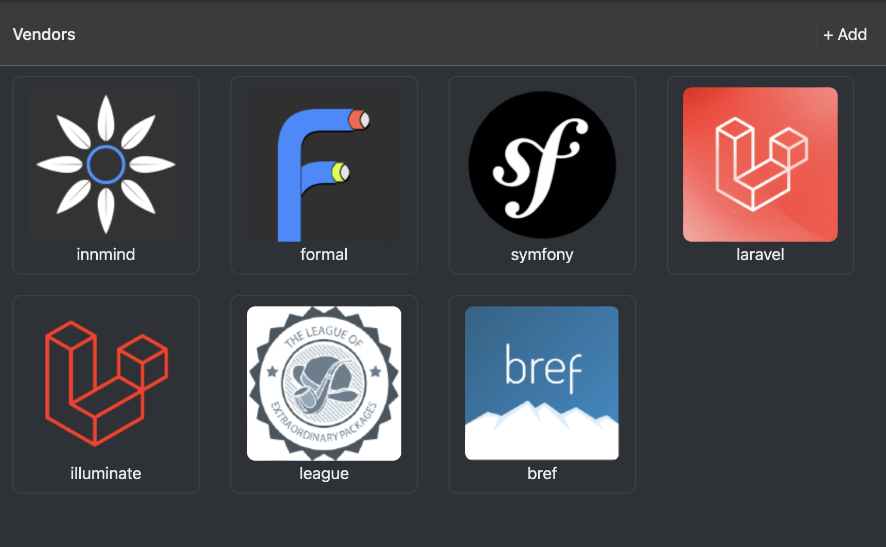

# UI

[](https://github.com/innmind/ui/actions?query=workflow%3ACI)
[](https://codecov.io/gh/innmind/ui)
[](https://shepherd.dev/github/innmind/ui)

Build web pages by composing PHP components instead of writing HTML.

This is heavily inspired from [SwiftUI](https://developer.apple.com/xcode/swiftui/).

## Philosophy

The goal is to have a UI system build on top of the Innmind ecosystem so it can work:

- with lazy evaluated data (such as `Sequence`s)
- asynchronously

This allows an app to work with any size of data safely. And the same app can move to an asynchronous execution mode without having to change its UI system.

This is achieved by inverting the traditional UI paradigm used in the PHP ecosystem. Instead of injecting the data into an HTML template, this package starts from the data and transform it into a list of HTML lines. With the HTML being represented as a `Sequence` it can handle any source of data.

## Installation

```sh
composer require innmind/ui
```

## Usage

```php
use Innmind\UI\{
    Button,
    Card,
    Grid,
    Image,
    NavigationLink,
    Shape,
    Stack,
    Text,
    Toolbar,
    Window,
};
use Innmind\Url\Url;
use Innmind\Immutable\Sequence;

$window = Window::of('Graphs', Stack::vertical(
    Toolbar::of(Text::of('Organizations'))
        ->trailing(Button::text(Url::of('/add'), '+ Add')),
    Grid::of(
        Sequence::of(...$strings)
            ->map(Text::of(...))
            ->map(static fn(Text $label) => Stack::vertical(
                Image::of(Url::of('https://avatars.githubusercontent.com/u/12136170?s=150&v=4'))
                    ->shape(Shape::circle),
                $label,
            ))
            ->map(static fn(Stack $label) => NavigationLink::of(
                Url::of('package.php'),
                $label,
            ))
            ->map(Card::of(...)),
    ),
))->stylesheet(Url::of('/themes/default.css'));

echo $window->render()->toString();
```

This would render something like this:



## Warning

> [!WARNING]
> This is NOT production ready.

This package is still experimental.

It's an attempt to build a replacement of the [macOS app](https://github.com/Innmind/macOS-tooling) hence the similarity to SwiftUI.

That being said you can still use it to build pet projects. Feedback on its API is welcome.
